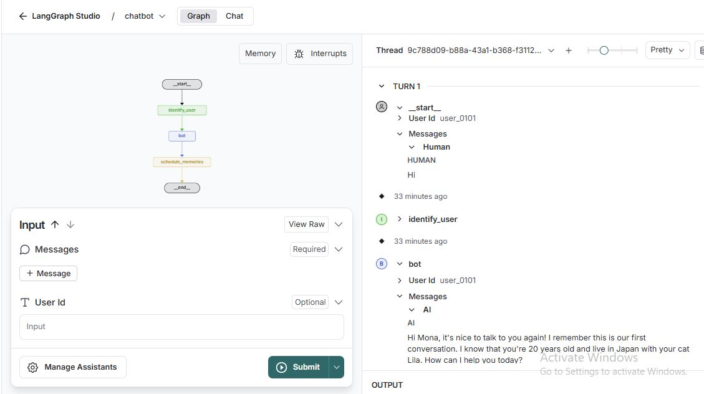

# Long-Term Memory System for Conversational Agents

This project implements a robust long-term memory system for conversational agents, enabling them to persist user-scoped memories (semantic, episodic, and procedural) across multiple conversation threads. The goal is to create more personalized, context-aware agents capable of adapting to individual users over time.

---

## Features

- **Persistent Memory Storage**: Ensures user-specific memories aren't lost between conversations.
- **User-Scoped Memory**: Uses `user_id` to namespace memory per user.
- **Configurable Memory Schemas**:
  - **Semantic Memory (User Profile)** – `update_mode: patch`
  - **Episodic Memory (Notes)** – `update_mode: append` + FAISS vector search
  - **Procedural Memory** – `update_mode: append`
- **Asynchronous Memory Management**: Background job processing ensures fast conversational performance.
- **Natural Language Integration**: Automatically extracts and updates memory without explicit prompts.
- **FAISS Integration**: Episodic memories are semantically indexed and retrieved efficiently using FAISS.

---

## Motivation

As conversational agents become more sophisticated, the ability to remember past interactions and user-specific details is crucial for delivering a truly personalized experience. This project provides a scalable, flexible, and developer-friendly long-term memory system that integrates seamlessly with LangGraph-based agents.

---

## Architecture Overview

The memory system is modular and decouples application flow from memory management:

- **Conversational Agent**: The main LangGraph agent handling user interaction.
- **Memory Scheduling**: Memory extraction jobs are triggered after each turn.
- **Memory Graph**: A dedicated `memory_graph` LangGraph extracts and updates memory.
- **Memory Stores**:
  - **LangMem Store**: For semantic (User) and procedural memory.
  - **FAISS Store**: For episodic Notes.
- **Persistence**: All memory is saved to disk, scoped by `user_id`.

---

## Output



*Ensure `static/architecture_diagram.png` exists in the project directory.*

---

## Setup and Installation

```bash
git clone <repository_url>
cd langchain_long_term_memory_system
```

### Create and activate a virtual environment

```bash
python -m venv venv

# On Windows
.\venv\Scripts\activate

```

### Install dependencies

```bash
pip install -r requirements.txt
```

Make sure `requirements.txt` includes:
- `langchain`
- `langgraph`
- `faiss-cpu`
- `google-cloud-aiplatform` (for Vertex AI)
- `tqdm`, `tenacity`, `python-dotenv`, etc.

---

## ☁️ Google Cloud Configuration (Optional)

If using Vertex AI:
1. Ensure a Google Cloud project is set up.
2. Authenticate:
   ```bash
   gcloud auth application-default login
   ```
3. Set environment variables:
   ```bash
   export GOOGLE_CLOUD_PROJECT=<your-project-id>
   export GOOGLE_CLOUD_LOCATION=<your-region>
   ```

---

## 🧪 Usage

### Run the application:

```bash
langrgaph dev
```

### Interact with the agent:

Example conversation:
```text
Hi
I am Mona and I am 20 years old. I live in China. I have a cat, her name is Lila.

What is my cat's name?
```

### Observe the debug logs:

Logs will show updates like:
- Semantic patch to User Profile
- New Note appended to episodic memory
- FAISS index updated
- Procedural sequence captured

---

## Memory Schemas

### User Profile (Semantic Memory)
- **update_mode**: `patch`
- Evolving structured memory per user.
- Example:
  > "Mona is 20 years old and lives in China. She has a cat named Lila."

---

### Notes (Episodic Memory)
- **update_mode**: `append`
- Concise event summaries stored in FAISS.
- Example:
  > "The user's name is Mona, she is 20 years old, lives in China, and has a cat named Lila."

---

### Procedural Memory
- **update_mode**: `append`
- Stores interaction flows or learned agent behavior.
- Example:
  > "The agent greeted the user, confirmed her name, age, location, and pet, and stored the information."

---

---

## Resources

- [LangGraph Documentation](https://docs.langgraph.dev/)
- [FAISS](https://github.com/facebookresearch/faiss)
- [Google Vertex AI](https://cloud.google.com/vertex-ai)
